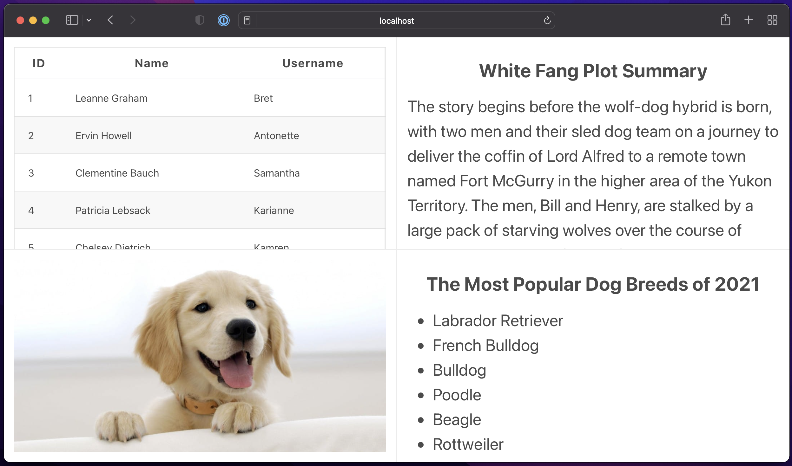

# Micro front-end web application

## Using the application

* _Micro front-end web application requires Node 15.0 or later (but probably should work with the v12-14 as well)_
* _Any modern browser with a version not older than two years._
* _Any Unix OS (macOS would be ideal)_

**Project Structure**

The main application consists of Server and Client part (in the `src` folder).
The client has initial config & creates placeholders for sub-applications and also loads them.
The server hosts the required static files and searches for the necessary sub-applications bundles.

In addition to the main application, we also have sub-applications in the `sub-applications` folder.
Each sub-application is in its own folder and has its own build process, package.json etc.

**Building**

To simply build an entire project with all sub-applications, run the following command in the root project folder

```sh
npm run project:build
```

Then simply start the server and open the URL displayed in the console (by default it's http://localhost:3000/)
```sh
npm run server
```

If you would like to do all builds manually, you have to build each application individually.
To build main app Client and Server 
```sh
npm i
npm run client:build
npm run server:build
```

Then open folder with each sub-application and run the following commands
```sh
npm i
npm run build
```

As a result, you will have one `bundle.js` file in the `build/{app-version}/` folder.
Each sub-application is also as a standalone application, so it can be
loaded directly into the browser.

**Server**

Application host and port can be configured through package.json `config` object.
To run the server with default settings:
```sh
npm run server
```

**Notes**

Build process requires any UNIX OS, but in the ideal world we would have a Docker that works on the Windows too. 

